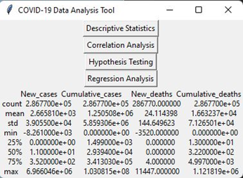
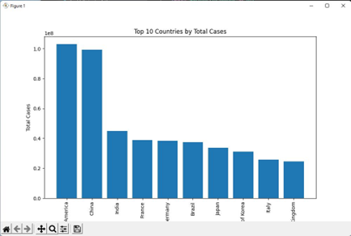
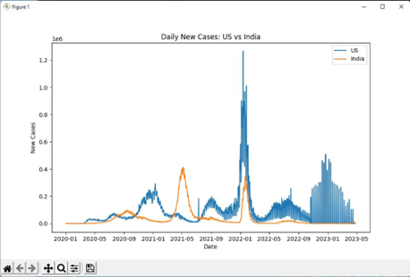
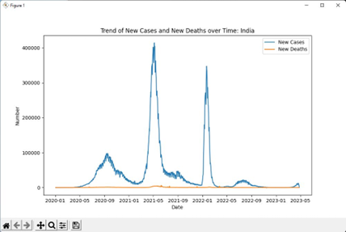
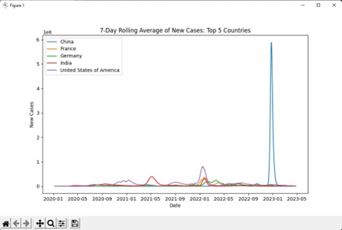
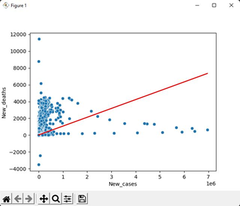

# COVID-19 Analysis and Visualization Python Tool

The COVID-19 Analysis and Visualization Python Tool is designed to help analyze and visualize COVID-19 data. This tool is valuable for researchers, policymakers, and the public to better understand the spread of the virus, its impact on different populations, and the effectiveness of prevention and treatment strategies.

## Project Overview

The COVID-19 pandemic presents various challenges, including the need for accurate and timely information to inform decision-making. This tool aims to provide a solution for collecting, storing, and processing COVID-19 data from multiple sources and presenting it clearly and effectively.

##Images

## Model and Methodology

### Data Collection
To begin, data needs to be collected from various sources, such as government websites, research papers, and public health organizations. It's crucial to ensure the data collected is accurate and reliable.

### Data Cleaning and Handling
The collected data must be cleaned and processed to ensure it's in a usable form. This involves eliminating duplicates, addressing missing values, and organizing the data into a consistent structure, which can be achieved using the Python Pandas library.

### Statistical Analysis
Once the data is clean and processed, statistical analysis is performed to identify patterns and correlations. This includes computing summary statistics, running regression models, and conducting hypothesis tests, with the help of Python NumPy and SciPy libraries.

### Data Visualization
Data visualization is a crucial step in making the analysis results understandable. Various libraries, such as Matplotlib and Seaborn, are used to create graphs, charts, and maps to depict trends and relationships in the data.

## Data Analysis and Interpretation

The following steps are executed to analyze and interpret the COVID-19 data:

- Identifying key metrics, including cases, deaths, and demographic information.
- Calculating descriptive statistics to summarize the data.
- Creating visualizations to better understand the data.
- Performing inferential statistics to test hypotheses and identify significant relationships.
- Interpreting the results and considering their implications for public health policy.

## Results and Implications

The analysis conducted with this tool has provided insights into the COVID-19 pandemic:

- Significant global impact with high numbers of cases and deaths.
- Regional differences in transmission and mortality rates.
- The role of vaccination and mitigation efforts in controlling the virus's spread.
- Limitations to the analysis, including potential reporting bias and ongoing changes in the pandemic.

## Project Components

This project consists of several Python scripts to handle various aspects of data analysis and visualization. Here is an overview of each script:

### 1. Data_Collection.py
This script collects COVID-19 data from a specified URL and saves it to a CSV file.

### 2. Data_Cleaning_and_Processing.py
It cleans and processes the collected data, preparing it for analysis. This script involves renaming columns, converting data types, and handling missing values.

### 3. Statistical_Analysis.py
This script performs statistical analysis, including descriptive statistics, correlation analysis, hypothesis testing, and regression analysis. It provides a graphical user interface for conducting these analyses.

### 4. Covid_Data_Analytics.py
This script focuses on data visualization and presents various visualizations, including bar charts, line charts, and growth rate calculations.

## Usage

1. **Data Collection:**
   - Run `Data_Collection.py` to collect COVID-19 data from the specified URL.

2. **Data Cleaning and Processing:**
   - Use `Data_Cleaning_and_Processing.py` to clean and prepare the data for analysis.

3. **Statistical Analysis:**
   - Execute `Statistical_Analysis.py` to perform various statistical analyses using a graphical user interface.

4. **COVID-19 Data Analytics:**
   - Run `Covid_Data_Analytics.py` to generate visualizations of COVID-19 data.

## Dependencies

Make sure you have the following Python libraries installed:

- Pandas
- NumPy
- SciPy
- Matplotlib
- Seaborn

## Getting Started

1. Clone this repository to your local machine.
2. Install the required dependencies using `pip install -r requirements.txt`.
3. Run the desired scripts as described in the "Usage" section.

## License

This project is licensed under the [MIT License](LICENSE).

Feel free to reach out for any questions or further assistance related to this project.
