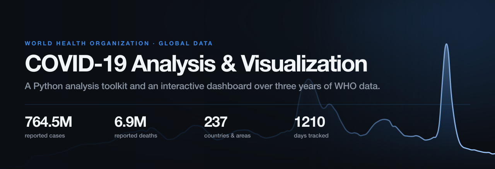
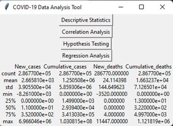
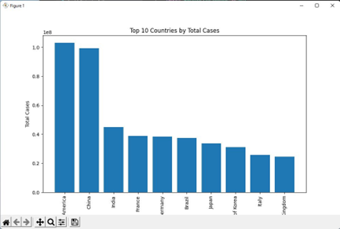
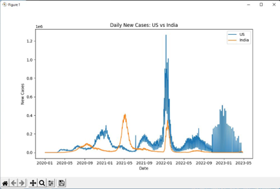
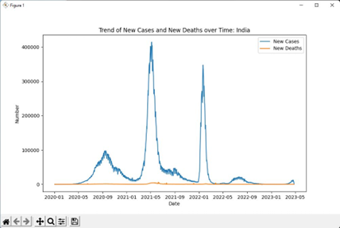
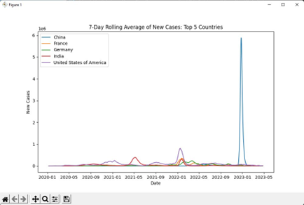
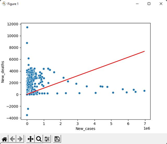

<p align="center">
  
</p>

<p align="center">
  <a href="#web-dashboard"></a>
  
  
  
  <a href="LICENSE"></a>
</p>

# COVID-19 Analysis and Visualization Python Tool

The COVID-19 Analysis and Visualization Python Tool is designed to help analyze and visualize COVID-19 data. This tool is valuable for researchers, policymakers, and the public to better understand the spread of the virus, its impact on different populations, and the effectiveness of prevention and treatment strategies.

> **The logo is the data.** The curve in the mark and the banner is the real global
> epidemic curve, traced straight out of the dashboard's own data bundle by
> `tools/make_brand.py`. Regenerate the data and the branding follows.

## Project Overview

The COVID-19 pandemic presents various challenges, including the need for accurate and timely information to inform decision-making. This tool aims to provide a solution for collecting, storing, and processing COVID-19 data from multiple sources and presenting it clearly and effectively.

## Web Dashboard

Alongside the Python scripts, the repository now ships an interactive web dashboard over the
same WHO dataset — 764,474,387 reported cases and 6,915,286 reported deaths across 237
countries and areas, from 3 January 2020 to 26 April 2023.

**Run it**

```bash
python3 -m http.server 8000 --directory web
```

Then open <http://localhost:8000>. The page also works by opening `web/index.html` directly
from the file system, and can be served as-is from GitHub Pages (set Pages to the `/web`
folder, or copy `web/` to the site root).

**What is in it**

| Section | What it shows |
| --- | --- |
| Global curve | Daily cases or deaths worldwide, with the trailing 7-day average, on a linear or logarithmic axis |
| World map | A Robinson-projection choropleth, shaded in seven classes; hover for numbers, click to open a country |
| Regions | Weekly totals stacked by WHO region, with a toggleable legend |
| Wave calendar | 24 countries × 40 months, each row shaded against its own peak month, so wave *timing* is readable independently of country size |
| Country panel | Any of the 237 countries: daily cases, daily deaths, cumulative totals and case fatality rate, each on its own axis |
| Compare | Up to five countries on one axis, each keeping its colour as others are added or removed |
| Table | Every country and area, sortable and filterable, with per-row sparklines and a CSV export |

A period selector (All / 2020 / 2021 / 2022 / 2023), a measure selector (cases / deaths) and a
scale selector sit in a single filter row that scopes every chart, figure and table on the page,
so no two numbers on screen can disagree about which slice they describe.

**Also in the dashboard**

* **Milestones.** Seven documented dates — the WHO's emergency declaration, the pandemic
  characterisation, the first vaccination outside a trial, the Alpha/Delta/Omicron
  designations, and China unwinding zero-COVID — drawn as numbered rules on the global
  curve with a key underneath. Toggleable.
* **Shareable views.** The full state of the page lives in the URL, so *Copy link* hands
  someone the exact period, measure, scale, country and comparison you are looking at.
* **Align by outbreak age.** The comparison chart can put day 0 at each country's 100th
  case instead of on a shared calendar, which lines the waves up by outbreak age.
* **Week-on-week change.** A diverging chart per country: above the line the outbreak was
  accelerating, below it, receding. This is the growth-rate analysis from
  `4. Covid_Data_Analytics.py`, made continuous.
* **Download SVG.** Any of the big charts can be exported as a standalone SVG with its
  colours inlined.

**How it is built**

* **No frameworks and no charting library.** Every mark is hand-drawn SVG in
  `web/assets/js/charts.js` (~700 lines): area and line charts with a snapping crosshair,
  a stacked area, ranked bars, the choropleth, the heatmap and the sparklines. There is no
  build step, no `node_modules`, and nothing is fetched from a CDN at runtime.
* **Charts re-render on resize** rather than scaling a viewBox, so labels stay the same size
  and tick density suits the width actually available.
* **The colour palette is validated, not eyeballed** — the categorical slots pass lightness,
  chroma, colour-blindness separation (protanopia and deuteranopia at full severity) and
  contrast checks against both the light and the dark surface. Colour follows the entity:
  cases are always blue, deaths always orange, and a WHO region keeps its hue no matter how
  the chart is filtered.
* **Accessible by construction.** Every chart carries an `aria-label` summary and a keyboard
  crosshair (arrow keys, Shift for a week, Home/End); the full table is the readable twin of
  every chart; the page is fully responsive and ships both a dark and a light theme.
* **Data is precomputed.** `tools/build_web_data.py` reads the CSV once and emits two bundles:
  `web/data/core.js` (~200 KB — global series, country index with per-year totals, region
  series, wave calendar, map geometry) and `web/data/series.js` (~1.5 MB — every country's
  daily series), which loads lazily after first paint. Whole-year totals are precomputed, so
  the map, ranking and table answer any period preset exactly without touching the large bundle.

**Regenerate the data**

```bash
python3 tools/build_web_data.py
```

Standard library only — no pandas needed. To refresh the map geometry (Natural Earth 1:110m
outlines plus the ISO 3166 code list, both committed under `tools/geo-sources/`):

```bash
python3 tools/fetch_geo_sources.py
```

**Brand assets**

`web/brand/` holds the mark, the horizontal logo, this banner, a social card and a favicon,
as both SVG and PNG. They are generated, not drawn by hand:

```bash
python3 tools/make_brand.py
```

<p align="center">
  
</p>

The curve in every asset is the global 7-day average from `web/data/core.js`, downsampled
with peak-preserving buckets and drawn on a square-root scale — on a linear scale the
December 2022 spike is so much taller than everything else that the first two years flatten
into a line. The dashboard itself never rescales like that; this is the one place the shape
is styled rather than measured.

## Images

Output from the Python visualisation scripts:








## Model and Methodology

### Data Collection
To begin, data needs to be collected from various sources, such as government websites, research papers, and public health organizations. It's crucial to ensure the data collected is accurate and reliable.

### Data Cleaning and Handling
The collected data must be cleaned and processed to ensure it's in a usable form. This involves eliminating duplicates, addressing missing values, and organizing the data into a consistent structure, which can be achieved using the Python Pandas library.

### Statistical Analysis
Once the data is clean and processed, statistical analysis is performed to identify patterns and correlations. This includes computing summary statistics, running regression models, and conducting hypothesis tests, with the help of Python NumPy and SciPy libraries.

### Data Visualization
Data visualization is a crucial step in making the analysis results understandable. Various libraries, such as Matplotlib and Seaborn, are used to create graphs, charts, and maps to depict trends and relationships in the data.

## Data Analysis and Interpretation

The following steps are executed to analyze and interpret the COVID-19 data:

- Identifying key metrics, including cases, deaths, and demographic information.
- Calculating descriptive statistics to summarize the data.
- Creating visualizations to better understand the data.
- Performing inferential statistics to test hypotheses and identify significant relationships.
- Interpreting the results and considering their implications for public health policy.

## Results and Implications

The analysis conducted with this tool has provided insights into the COVID-19 pandemic:

- Significant global impact with high numbers of cases and deaths.
- Regional differences in transmission and mortality rates.
- The role of vaccination and mitigation efforts in controlling the virus's spread.
- Limitations to the analysis, including potential reporting bias and ongoing changes in the pandemic.

## Project Components

This project consists of several Python scripts to handle various aspects of data analysis and visualization. Here is an overview of each script:

### 1. Data_Collection.py
This script collects COVID-19 data from a specified URL and saves it to a CSV file.

### 2. Data_Cleaning_and_Processing.py
It cleans and processes the collected data, preparing it for analysis. This script involves renaming columns, converting data types, and handling missing values.

### 3. Statistical_Analysis.py
This script performs statistical analysis, including descriptive statistics, correlation analysis, hypothesis testing, and regression analysis. It provides a graphical user interface for conducting these analyses.

### 4. Covid_Data_Analytics.py
This script focuses on data visualization and presents various visualizations, including bar charts, line charts, and growth rate calculations.

### web/
The interactive dashboard described above — a static site with no dependencies.

### tools/
`build_web_data.py` turns the CSV into the dashboard's data bundles; `fetch_geo_sources.py`
downloads the map sources; `geo.py` projects TopoJSON country outlines into SVG paths;
`make_brand.py` generates the brand assets from the global curve.

## Usage

1. **Data Collection:**
   - Run `Data_Collection.py` to collect COVID-19 data from the specified URL.

2. **Data Cleaning and Processing:**
   - Use `Data_Cleaning_and_Processing.py` to clean and prepare the data for analysis.

3. **Statistical Analysis:**
   - Execute `Statistical_Analysis.py` to perform various statistical analyses using a graphical user interface.

4. **COVID-19 Data Analytics:**
   - Run `Covid_Data_Analytics.py` to generate visualizations of COVID-19 data.

## Dependencies

Make sure you have the following Python libraries installed:

- Pandas
- NumPy
- SciPy
- Matplotlib
- Seaborn

## Getting Started

1. Clone this repository to your local machine.
2. Install the required dependencies using `pip install -r requirements.txt`.
3. Run the desired scripts as described in the "Usage" section.

## License

This project is licensed under the [MIT License](LICENSE).

Feel free to reach out for any questions or further assistance related to this project.
